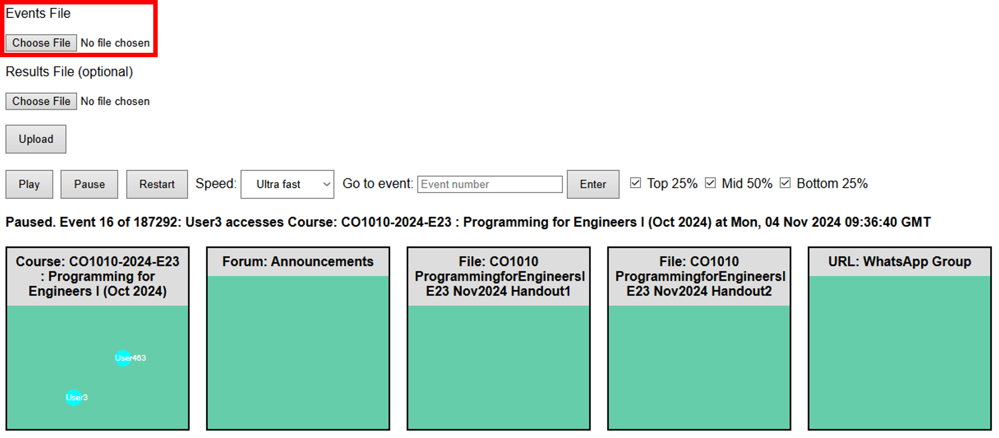
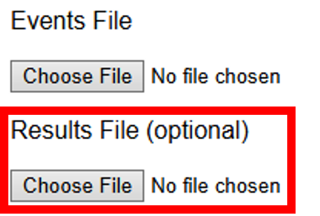
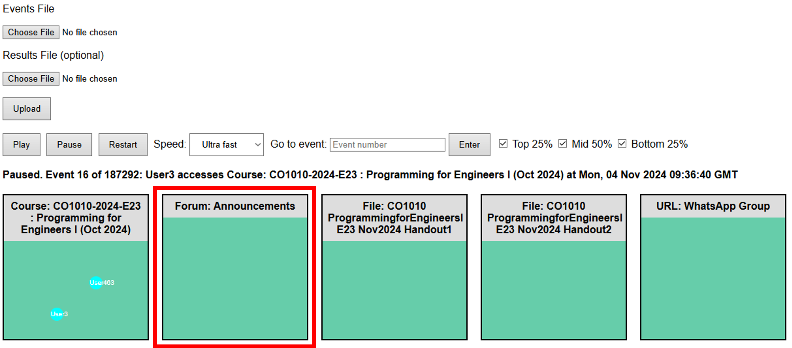
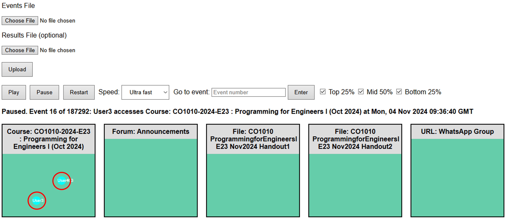
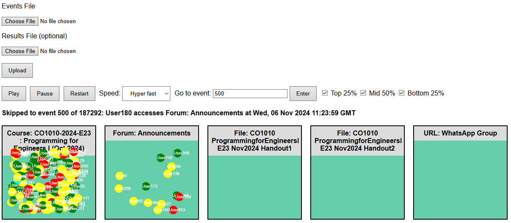
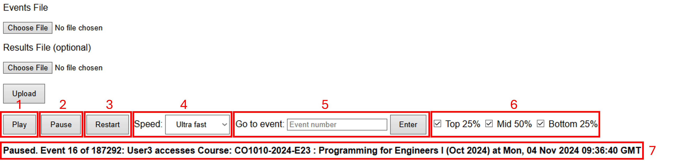

# MoodleVisualizer
***Created by Dulith Polpitiya***

This program receives Moodle log files as an input and displays a visualization that showcases how users interact with the website and their course.

## How to run

1. Before the playback can be accessed, all log files and marks files **must** be anonymized. The script to anonymize these files can be found [here](https://github.com/Nuveen540/MoodleAnonymizer).
2. Run ``app.py`` on your preferred Python interpreter, and access the host website.
3. Upload the log file to this label that says "events file". **This field is required**.

4. Upload the final marks file to this label that says "results file". This field is optional.

5. Press upload.
6. Press 'Play' to begin the playback.

## Using the Event Visualizer

Now you've uploaded all your files to the site. Great! Once you've pressed the play button, you should probably see something like this:

The various boxes you see represent the different **course modules**. A module can be an assignment, a file, or a link to an external webpage. Each module in the course is represented by its own box.

But, wait a minute! What are these small dots? Each dot represents a **user**. Anyone who interacts with the course website will be recognized as a user: mainly students, but also instructors, TAs, and admins. The dots also display their username.

Dots can have different colors, depending on the student's final grade.
* Students who received the top 25% of scores are denoted with **green dots**.
* Students who received the middle 50% of scores are denoted with **yellow dots**.
* Students who received the bottom 25% of scores are denoted with **red dots**.
* All non-student users (such as staff and TAs) are denoted with **cyan dots**.
* If you choose not to upload a results file, all dots will be **cyan** by default.

## Other Features

The Event Visualizer can be interacted with in various ways.

1. **Play button**: Plays the playback.
2. **Pause button**: Pauses the playback.
3. **Restart button**: Resets the playback to the beginning.
4. **Speed**: Determines the speed of the playback. There are 6 different speed options, from slow to hyper fast.
5. **Go to event**: Here, the user can enter a number, and upon pressing the 'Enter' button, the playback automatically skips to that event. This can be used to skip to a later event or to revert to a previous event. The playback will automatically be paused until the user presses the 'Play' button.
6. **Student togglers**: These boxes, when checked, will show the respective users. If unchecked, these users will be hidden. Top 25% hides the green dots, Middle 50% hides the yellow dots, and Bottom 25% hides the red dots. This feature is useful for filtering students by their grades and comparing patterns between high-scoring and low-scoring students.
7. **Event description**: This single line of text contains the following information: the current event, the user performing the event, the module accessed, and the time of the event. It also denotes whether the playback is paused.
